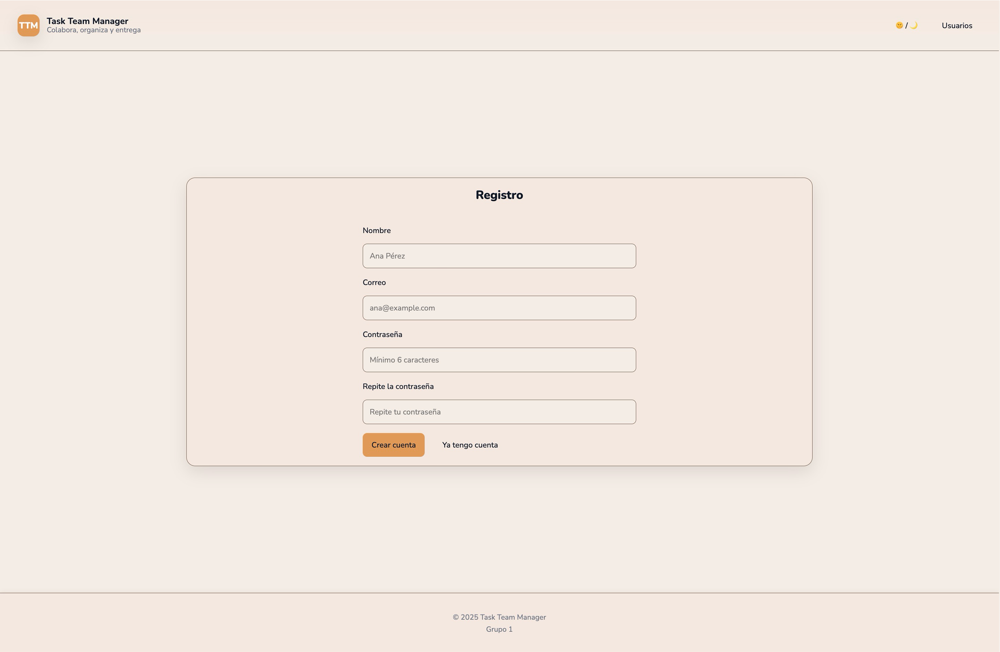
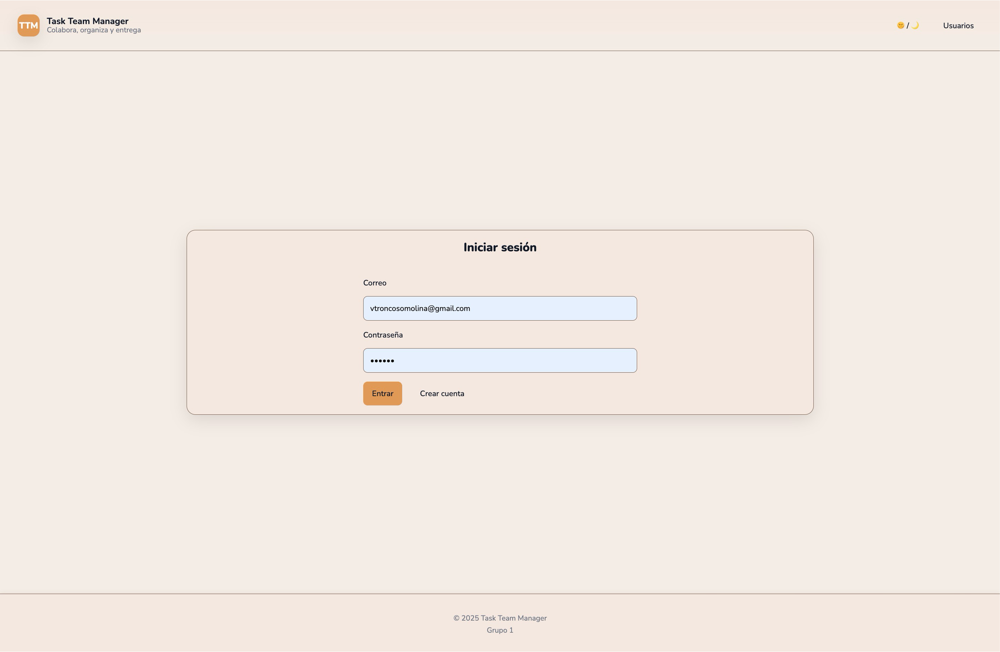
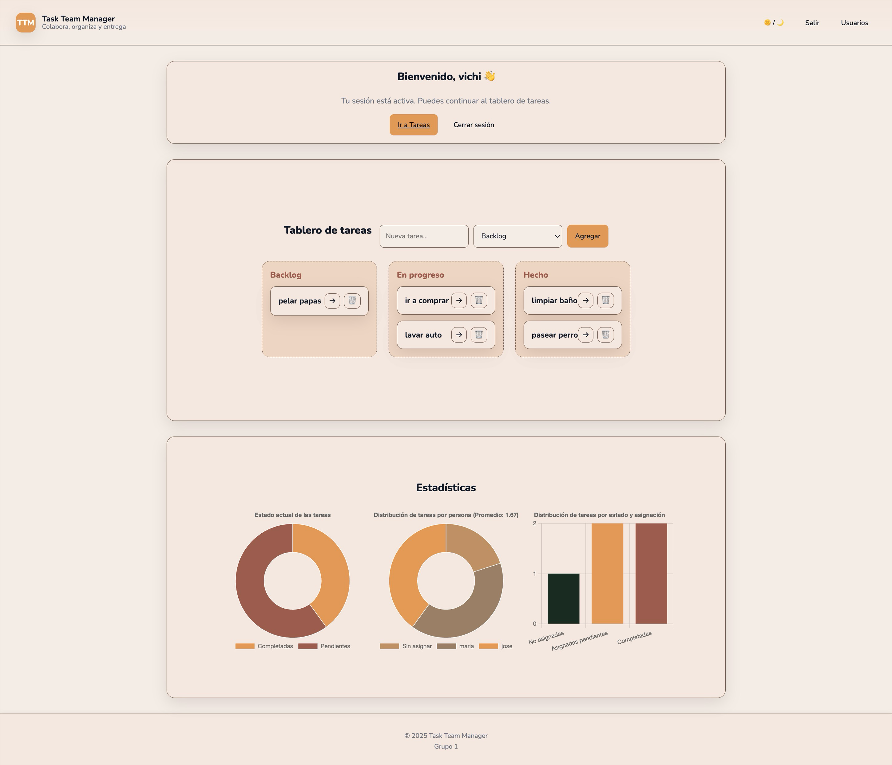
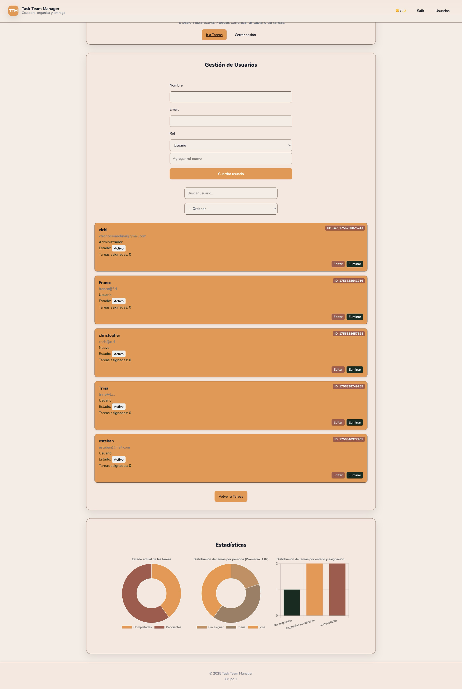
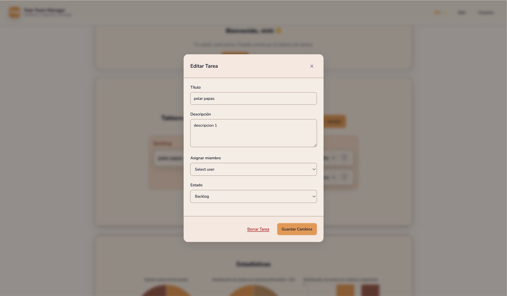
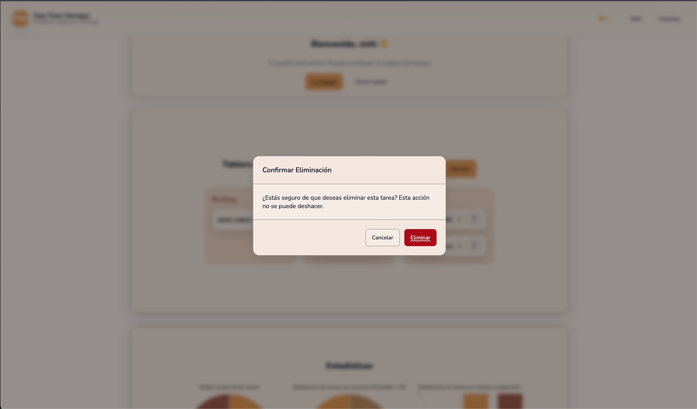
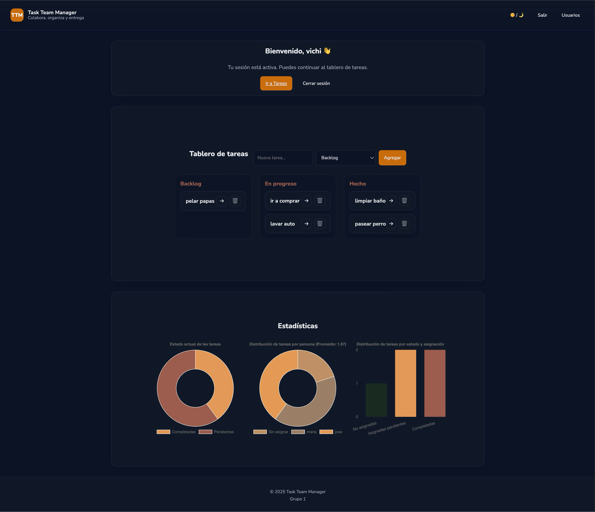

# Task Team Manager

Task Team Manager es una aplicación web de una sola página (SPA) para la gestión de tareas en equipo. Permite a los usuarios colaborar, organizar y dar seguimiento al progreso de diferentes proyectos de una manera visual e intuitiva.

## ✨ Características

- **Autenticación de Usuarios:** Sistema de registro e inicio de sesión.
- **Tablero Kanban:** Organiza tareas en columnas (`Backlog`, `En Progreso`, `Hecho`).
- **Gestión de Tareas:** Crea, edita, asigna y elimina tareas.
- **Funcionalidad Drag & Drop:** Mueve tareas entre columnas fácilmente.
- **Gestión de Usuarios:** Administra los usuarios de la aplicación (CRUD).
- **Estadísticas Visuales:** Gráficos interactivos para visualizar el estado de las tareas y la carga de trabajo del equipo.
- **Tema Claro y Oscuro:** Interfaz adaptable a las preferencias del usuario.
- **Diseño Responsivo:** Adaptable a diferentes tamaños de pantalla.

## 📂 Estructura de Archivos

```
.
├── js/
│   ├── christopher.js      # Lógica para gráficos y carga de datos inicial.
│   ├── controlUsuarios.js  # Lógica para el CRUD de usuarios.
│   ├── crudTareas.js       # Lógica para el CRUD de tareas (modales).
│   └── login.js            # Lógica de autenticación, sesión y renderizado del tablero.
├── pages/
│   └── index.html          # Archivo HTML principal de la aplicación.
├── src/
│   └── assets/
│       ├── modal.css       # Estilos para los modales.
│       └── style.css       # Estilos principales de la aplicación.
└── README.md
```

## 🚀 Instrucciones de Ejecución

Este proyecto no requiere un servidor de backend complejo, ya que funciona directamente en el navegador utilizando `localStorage` como base de datos.

1.  **Clonar el repositorio (opcional):**
    ```bash
    git clone <url-del-repositorio>
    ```
2.  **Abrir el archivo principal:**
    Simplemente abre el archivo `pages/index.html` en tu navegador web preferido (como Chrome, Firefox, o Edge).

    > 💡 **Nota:** No es necesario ejecutar un servidor local. Todas las funcionalidades están autocontenidas en el cliente.

## 📸 Capturas de Pantalla

A continuación se muestran las pantallas principales de la aplicación.

### Login




### Tablero Principal con Gráficos (Index)



### Tabla de Usuarios



### Modal de Edición de Tarea



### Modal de Borrar Tarea



### Modo Oscuro



## 🧑🏻‍💻 Equipo 1 - Bootcamp FrontEnd UNAB

- Christopher Guala
- Franco Giaverini
- Isabel Palacios
- Valentina Troncoso
